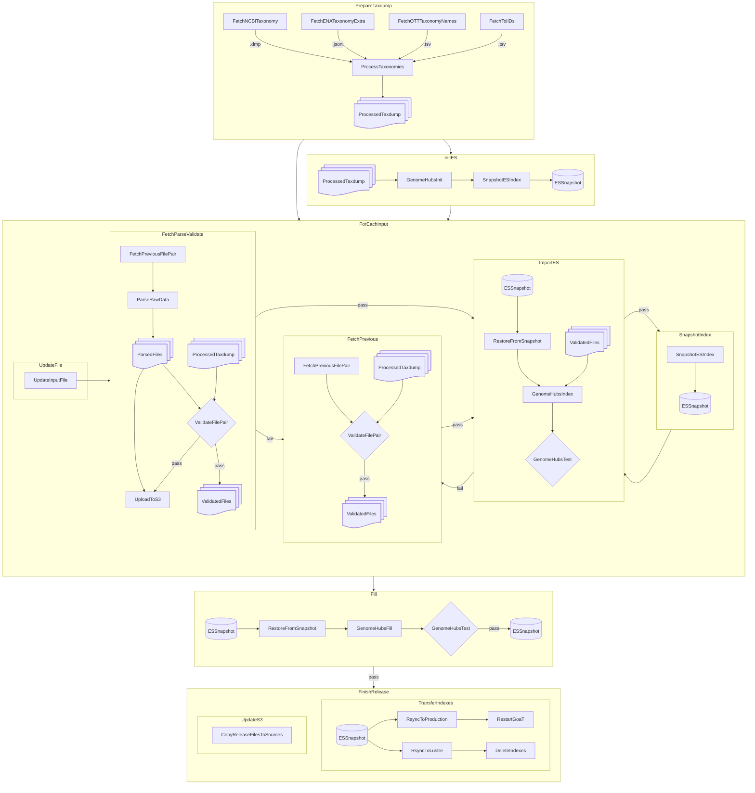
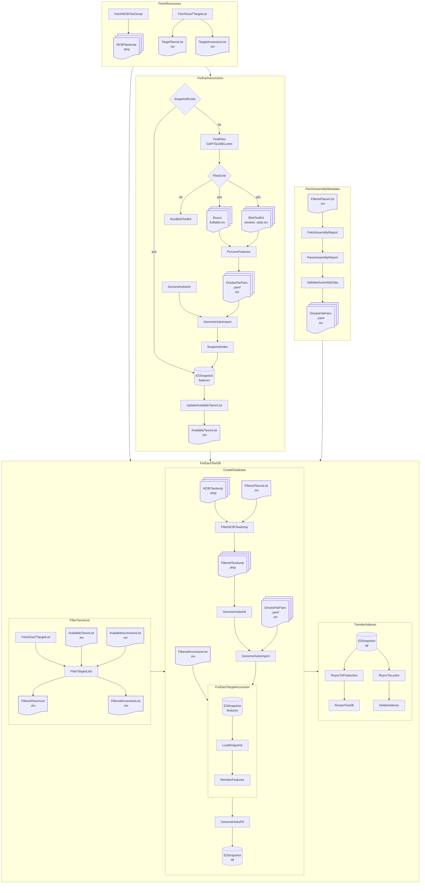

# genomehubs-data

Individual GenomeHubs sites have independent data processing and import pipelines. This directory is a place to collate common scripts and documentation to make it easier to reuse pipeline components across different sites.

The core pipelines are currently being redeveloped as outlined below:

## goat-data

The GoaT data pipeline is used for [goat.genomehubs.org](https://goat.genomehubs.org) and makes use of data and configuration files at [goat.cog.sanger.ac.uk](https://goat.cog.sanger.ac.uk) and [github.com/genomehubs/goat-data](https://github.com/genomehubs/goat-data), respectively.



## taxdb-data

The TaxDB data pipeline is intended to be shared across [BoaT](https://boat.genomehubs.org) and related taxon DBs, including [MolluscDB](https://molluscdb.genomehubs.org), the soon to be updated [LepBase](https://lepbase.genomehubs.org) and the forthcoming IsopoDB.



### FetchResources

#### FetchGoatTargetList

Generate `taxon_list.tsv` with:
```
SKIP_PREFECT=true python3 src/data/flows/lib/fetch_goat_target_list.py -q "query:tax_rank(species) AND assembly_level>=chromosome&fields:none"
```

Generate `assembly_list.tsv` with:
```
SKIP_PREFECT=true python3 src/data/flows/lib/fetch_goat_target_list.py -q "query:tax_rank(species) AND assembly_level=chromosome AND refseq_category&fields:none" -x assembly
```