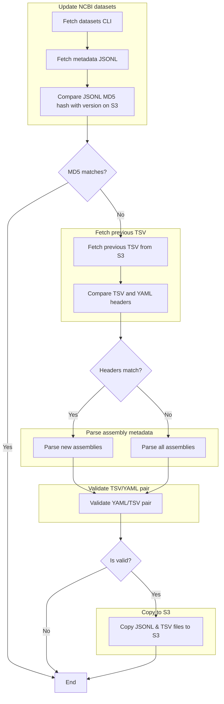

# Fetch and parse INSDC assembly metadata



## Install `datasets` CLI

```
curl -L https://ftp.ncbi.nlm.nih.gov/pub/datasets/command-line/v2/linux-amd64/datasets > datasets
chmod 755 datasets
```

## Install `s3cmd` CLI

```

```
